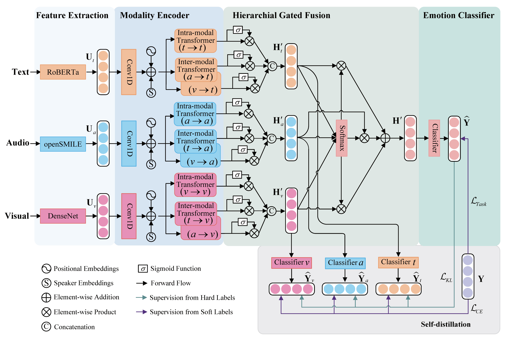

# SDT
This repository is the implementation for our paper *[A Transformer-based Model with Self-distillation for Multimodal Emotion Recognition in Conversations](https://ieeexplore.ieee.org/abstract/document/10109845)*.

## Model Architecture
<!--  -->
<div align="center">
    
</div>

## Setup
- Check the packages needed or simply run the command:
```console

pip install -r requirements.txt
```
- Download the preprocessed datasets from [here](https://drive.google.com/drive/folders/1J1mvbqQmVodNBzbiOIxRiWOtkP6qqP-K?usp=sharing), and put them into `data/`.

## Run SDT model
- Run the model on IEMOCAP dataset:
```console

bash exec_iemocap.sh
```
- Run the model on MELD dataset:
```console

bash exec_meld.sh
```

## Acknowledgements
- Special thanks to the [COSMIC](https://github.com/declare-lab/conv-emotion) and [MMGCN](https://github.com/hujingwen6666/MMGCN) for sharing their codes and datasets.

## Citation
If you find our work useful for your research, please kindly cite our paper. Thanks!
```
@article{ma2024sdt,
  author={Ma, Hui and Wang, Jian and Lin, Hongfei and Zhang, Bo and Zhang, Yijia and Xu, Bo},
  journal={IEEE Transactions on Multimedia}, 
  title={A Transformer-Based Model With Self-Distillation for Multimodal Emotion Recognition in Conversations}, 
  year={2024},
  volume={26},
  number={},
  pages={776-788},
  keywords={Emotion recognition;Transformers;Oral communication;Context modeling;Task analysis;Visualization;Logic gates;Multimodal emotion recognition in conversations;intra- and inter-modal interactions;multimodal fusion;modal representation},
  doi={10.1109/TMM.2023.3271019}}

```
